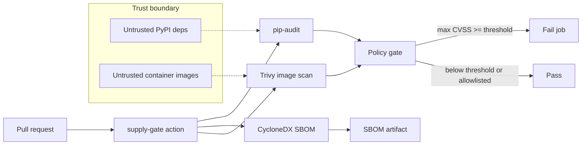

# supply-gate

A composite GitHub Action and Python CLI that gates a repository on supply-chain
findings. It runs a Python dependency audit (`pip-audit`), emits a CycloneDX
SBOM, optionally scans a container image with Trivy, and fails the job when any
finding has **CVSS ≥ 8.0** (configurable). Results are written as SARIF and a
GitHub job summary.

Python 3.11 or newer. No runtime Python dependencies — `pip-audit` and `trivy`
are invoked as external tools.



Untrusted inputs sit **outside** the gate: packages from PyPI and layers in a
container image. The action and CLI only parse scanner output and apply policy.
See [THREAT_MODEL.md](THREAT_MODEL.md).

## Install

```bash
pip install .
# scanners used by `audit` / `image` / `run`:
pip install pip-audit
# plus the Trivy binary for image scans
```

From a checkout:

```bash
pip install -e ".[dev]"
make test
```

## CLI

```bash
supply-gate audit --path .                 # pip-audit JSON → findings
supply-gate sbom --path . --output sbom.cdx.json
supply-gate image --image my/app:tag       # requires trivy on PATH
supply-gate policy --input audit.json --input trivy.json --threshold 8.0
supply-gate run --path .                   # audit + sbom + policy
supply-gate run --path . --image my/app:tag
```

`run` is what the GitHub Action calls. It always writes `supply-gate.sarif`,
`supply-gate.md`, and `sbom.cdx.json` unless you override the paths.

| Flag | Meaning |
| --- | --- |
| `--threshold` | Fail if any non-allowlisted finding has CVSS ≥ this value (default `8.0`) |
| `--allowlist` | Comma-separated IDs (`CVE-…`, `GHSA-…`, `PYSEC-…`); aliases match too |
| `--allowlist-file` | One ID per line (`#` comments allowed) |
| `--format` | Stdout: `markdown` (default), `json`, or `sarif` |
| `--on-missing-trivy` | `fail` (default when `--image` is set) or `skip` |
| `--audit-json` / `--trivy-json` | Parse saved scanner JSON instead of invoking tools |

Exit status: `0` policy pass, `1` policy fail, `2` tool or usage error.

## GitHub Action

```yaml
- uses: smaefr/supply-gate@v0
  with:
    path: .
    threshold: "8.0"
    # image: my/app:tag   # optional; requires the Trivy step in the action
    # allowlist: "CVE-0000-0001,GHSA-0000-0000-0001"
    format: markdown
```

Inputs: `path`, `image`, `threshold`, `allowlist`, `format`.

The composite action installs this package, `pip-audit`, and Trivy (official
install script), then runs `supply-gate run`. Trivy is always installed so CI
can require an image scan; if `image` is empty the CLI does not invoke it.

This repo dogfoods the action in [`.github/workflows/ci.yml`](.github/workflows/ci.yml)
(dependency audit + SBOM). Image scan is optional: build `Dockerfile` and pass
`image:`. OS CVEs in a public base image can fail the default 8.0 gate.

## Makefile

| Target | What it does |
| --- | --- |
| `make test` | pytest with coverage (fails under 80%) |
| `make lint` | ruff |
| `make check` | `docker run aquasec/trivy fs` on this tree |

`make check` **skips** (exit 0) when Docker is not installed and prints why.
That target is a local filesystem scan, not the Python policy CLI. For an image
scan locally:

```bash
docker build -t supply-gate:local .
docker run --rm aquasec/trivy:latest image supply-gate:local
```

## Policy

CVSS is taken from scanner JSON (`cvss`, `cvss_v3.score`, Trivy `CVSS.*.V3Score`,
…). Findings with **no numeric score do not fail** the gate. Allowlisted IDs
(and their aliases) are reported but ignored by the threshold.

Unit tests parse fixtures under `tests/fixtures/` (a CVSS 9.8 and a CVSS 4.0 in
both pip-audit and Trivy JSON). They do not call the network or require Trivy.

## Limitations

- `pip-audit` and Trivy must be installed for live scans; the CLI does not
  bundle vulnerability databases.
- Missing CVSS is treated as unknown, not zero. A HIGH finding without a score
  will not trip a numeric threshold.
- An allowlist is a standing exception. Keep it small and reviewed.
- This is a gate, not a substitute for pinning, provenance, or code review.
